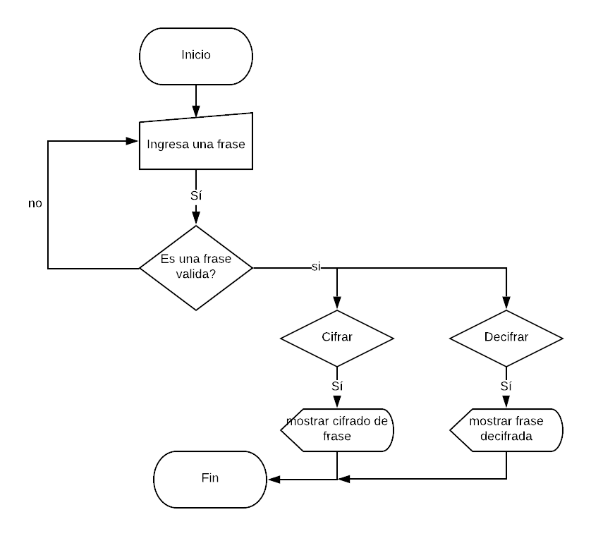

# CIFRADO CESAR

### Descripción:

Crea una web que pida, por medio de un prompt(), una frase al usuario y devuelva el mismo mensaje encriptado
según el algoritmo de Cifrado César con el parámetro de desplazamiento de 33 espacios hacia la derecha

## Pseudocódigo:

1.- Pedir una frase al usuario 
2.- checar que no se haya ingresado un campo vacio o con números, de ser así regresar a pedir la frase. 
3.- una vez que la frase sea válida, cifrar o decifrar la frase (usar las funciones cipher o decipher) 
4.- mostrar el resultado del cifrado o decifrado.

### Descripción:

1.- debe ser capaz de cifrar y descifrar tanto letras mayúsculas como minúsculas. La fórmula para descifrar es: (x - n) % 26 
2.- debe estar compuesto por 2 funciones con los siguientes nombres: cipher y decipher 
3.- El usuario no debe poder ingresar un campo vacío o que contenga números

## Diagrama de flujo:

