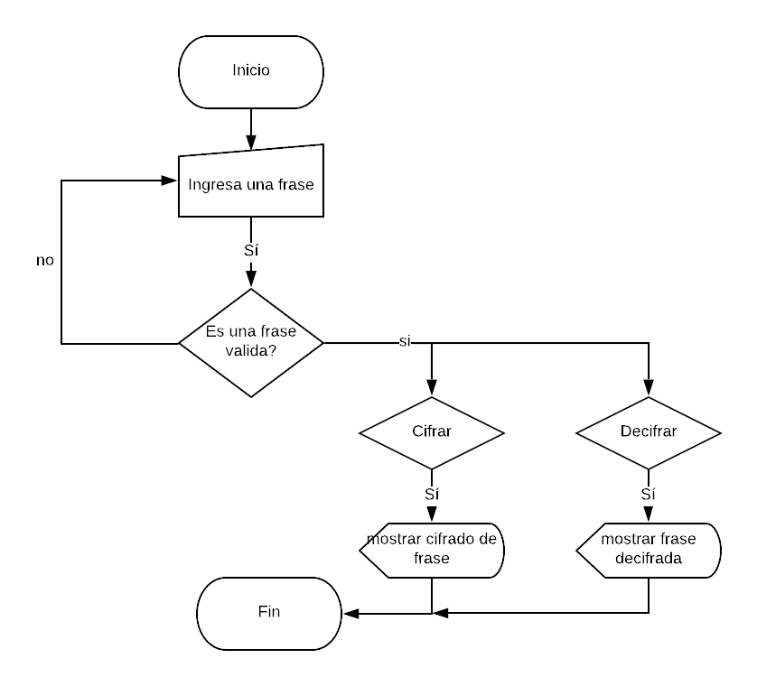

# CIFRADO CESAR

### Descripción:

Web que pide por medio de un prompt(), una frase al usuario y devuelve el mismo mensaje encriptado
según el algoritmo de Cifrado César con el parámetro de desplazamiento de 33 espacios hacia la derecha.

## Pseudocódigo:

1.- Pedir una frase al usuario 
2.- Verificar que no se ingrese un campo vacio o con números, de ser así regresar a pedir la frase al prompt de inicio. 
3.- Una vez que la frase sea válida, cifrar la frase usando la función **_cipher_** 
4.- Mostrar el resultado del cifrado.
5.- Tener la opción de decifrado usando la función **_decipher_** que al igual que cipher, valide se ingresen sólo caracteres válidos.
6.- Mostrar mensaje decifrado.

### Descripción:

1.- debe ser capaz de cifrar y descifrar tanto letras mayúsculas como minúsculas. La fórmula para descifrar es: (x - n) % 26 
2.- debe estar compuesto por 2 funciones con los siguientes nombres: cipher y decipher 
3.- El usuario no debe poder ingresar un campo vacío o que contenga números.

## Diagrama de flujo:

